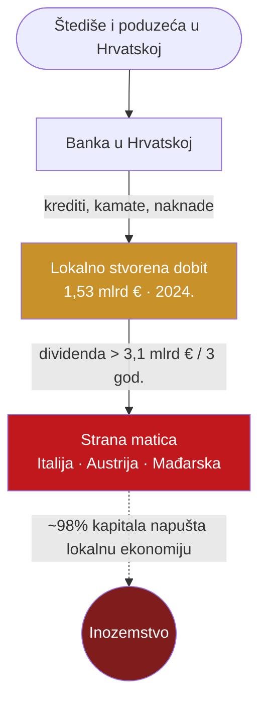

# Problem: ekstrakcijska ekonomija

> **Poanta u jednoj rečenici:** hrvatski bankarski sektor je gotovo u potpunosti u stranom vlasništvu, pa dobit koja se stvori ovdje — odlazi van.

---

## Činjenice

| Tvrdnja | Broj | Izvor |
|---|---|---|
| Bankovne aktive u stranom vlasništvu | **≈ 89–90%** | HNB *Bilten o bankama*; N1 (88,9%) |
| Rekordna dobit sektora 2024. | **1,53 mlrd €** | HNB (tportal, 03/2025) |
| Dobit sektora 2023. | 1,36 mlrd € (+91%) | HNB (fondovi.hr) |
| Dividende stranim vlasnicima 2022.–2024. | **> 3,1 mlrd €** | Telegram.hr / HNB platna bilanca |
| Udio tih dividendi koji napušta Hrvatsku | **~98%** (97,8% za ZABA+PBZ = 802 mil €) | Telegram.hr |
| HNB platio bankama za prekonoćne depozite 2024. | 532,2 mil € | HNB fin. izvještaj 2024. |
| ROE sektora 2024. | 16,4% | HNB |
| Stopa loših kredita (NPL) 2023. | 2,6% | HNB |

**Šest banaka drži ~90% tržišta, a ~90% te aktive je u stranom vlasništvu.** Pet stranih matica: UniCredit (IT), Intesa Sanpaolo (IT), Erste (AT), Raiffeisen (AT), OTP (HU).

---

## Kako novac odlazi — dijagram

*Lokalna likvidnost stvara se ovdje — ali multiplikator (efekt da novac kruži i gradi lokalnu ekonomiju) gubi se kad dobit ode van.*

---

## Zašto je to važno (plain language)

Kad banka u stranom vlasništvu zaradi, ta zarada ne ostaje da financira hrvatske firme, plaće i projekte. Ona se kao dividenda isplaćuje matici u inozemstvu i tamo nestaje iz domaćeg optjecaja.

Za usporedbu razmjera: dividende od ~3 mlrd € u tri godine **veće su od godišnje potrošnje EU fondova** i **veće od petogodišnjeg proračuna za vojnu nabavu** (Telegram.hr / HNB).

Dodatno: HNB je samo u 2024. isplatio bankama **532 mil €** kamata na novac koji drže "preko noći" kod središnje banke — dobit koja velikim dijelom također odlazi van.

> Nije poanta da su banke "zle". Poanta je **gdje se akumulira likvidnost i tko kontrolira novčanu infrastrukturu.** Vidi [02-vlasnistvo-stablo](02-vlasnistvo-stablo.md) za to tko su krajnji vlasnici, i [03-povijest-rasprodaje](03-povijest-rasprodaje.md) za to kako smo dovde došli.

---

## Rješenje (most prema airKUNA)

Regulirani euro stablecoin drži rezervu **pod domaćom kontrolom**. Ta rezerva može stajati u etičkoj banci koja je usmjerava u lokalni kredit, a platne marže (naknade na plaćanja) mogu ostati u domaćoj ekonomiji umjesto da odu na strane kartične mreže. Vidi [06-rjesenje-stablecoin](06-rjesenje-stablecoin.md).
