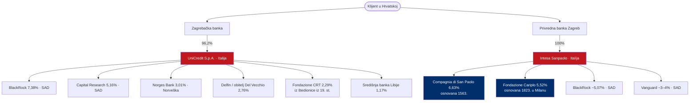

# Tko zapravo zarađuje na hrvatskim bankama

> **Poanta u jednoj rečenici:** novac s tvog računa na kraju putuje fondovima na Wall Streetu i talijanskim zakladama starima i do 460 godina.

Dividenda ne staje kod "strane matice". Matice su i same u vlasništvu drugih — pa novac putuje u slojevima sve do krajnjih vlasnika.

---

## Lanac vlasništva — dijagram

---

## Vlasništvo matica (provjereno)

### Zagrebačka banka → UniCredit (96,2%)
| Dioničar UniCredita | Udio | Tip | Zemlja |
|---|---|---|---|
| BlackRock | 7,38% | upravitelj imovinom | SAD |
| Capital Research | 5,16% | upravitelj imovinom | SAD |
| FMR / Fidelity | 3,10% | upravitelj imovinom | SAD |
| Norges Bank | 3,01% | državni (naftni) fond | Norveška |
| Allianz | 2,98% | osiguranje | Njemačka |
| Delfin (Del Vecchio) | 2,76% | obiteljski holding | Luksemburg |
| Fondazione CRT | 2,29% | zaklada (Torino, 19. st.) | Italija |
| Središnja banka Libije | 1,17% | središnja banka | Libija |

### PBZ → Intesa Sanpaolo (100%)
| Dioničar Intese | Udio | Tip |
|---|---|---|
| Compagnia di San Paolo | 6,63% | zaklada, **osnovana 1563.** |
| Fondazione Cariplo | 5,52% | zaklada, **osnovana 1823.** |
| BlackRock | ~5,07% | upravitelj imovinom (SAD) |
| Vanguard | ~3–4% | upravitelj imovinom (SAD) |

*Talijanske bankarske zaklade zajedno drže ~17–18% Intese.*

### Erste, RBA, OTP — ukratko
- **Erste Group (AT):** sindikat austrijskih štedionica (Sparkassen 13,3%, ERSTE Foundation iz 1819.), uz BlackRock 5,4% i Vanguard 3,33%.
- **Raiffeisen (RBI, AT):** 61,17% drži 8 austrijskih regionalnih zadružnih banaka (iza njih ~1,7 mil. lokalnih članova).
- **OTP (HU):** najveći pojedinačni dioničar je naftna kompanija MOL (8,57%); 54,5% drže strani institucionalni ulagači.

### HPB — iznimka
Hrvatska poštanska banka u ~77% je državnom/domaćem vlasništvu (Ministarstvo financija, Hrvatska pošta, mirovinski fondovi). **Dobit ostaje u Hrvatskoj.**

---

## Tko stoji iza fondova (plain language)

BlackRock i Vanguard nisu "vlasnici" u klasičnom smislu — oni drže dionice **u ime svojih klijenata** (mirovinski fondovi, mirovinske ušteđevine, osiguranja). Zajednička imovina pod upravljanjem velikih upravitelja prelazi 28 bilijuna $.

Talijanske zaklade (Compagnia di San Paolo iz **1563.**, Cariplo iz **1823.**) nasljeđe su regionalnih štedionica; one su istovremeno stabilni dugoročni vlasnici banaka i financijeri talijanskih kulturnih i socijalnih projekata — financiranih, dijelom, dobiti iz Hrvatske.

> Jednostavno rečeno: kamata i naknada koju Hrvat plati svojoj banci putuje preko Milana i Torina sve do fonda na Wall Streetu i zaklade stare 460 godina.
