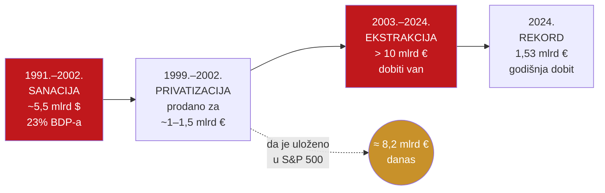

# Kako smo došli dovde: rasprodaja banaka 1992.–2025.

> **Poanta u jednoj rečenici:** platili smo ~5,5 milijardi dolara da sredimo banke, prodali ih za ~1–1,5 milijardi eura, a od tada je izvučeno više od 10 milijardi eura.

---

## Tri vala (plain language)

1. **Sanacija (1991.–2002.):** Hrvatska je naslijedila banke s gubicima iz Jugoslavije i kroz dvije krize. Porezni obveznici platili su **~5,5 mlrd $ (23% BDP-a iz 1996.)** da banke budu "očišćene".
2. **Privatizacija (1999.–2002.):** sanirane banke prodane su stranim grupama za **~1,0–1,5 mlrd €** — daleko ispod troška sanacije. Udio stranog vlasništva skočio je sa 6,7% (1998.) na 90% (2002.) u samo četiri godine.
3. **Konsolidacija i ekstrakcija (2003.–danas):** broj banaka pao s **60 (1997.) na ~19–20 (2025.)**; strane matice od tada izvlače **> 10 mlrd €** kumulativne dobiti.

---

## Vremenska crta — dijagram

---

## Ključne transakcije (dokumentirano)

| Banka | Godina | Kupac | Udio | Cijena |
|---|---|---|---|---|
| PBZ (1. krug) | 1999. | BCI / Intesa | 66,3% | ~301 mil € |
| Riječka banka | 2002. | Erste | 85% | 155 mil € (od toga 100 mil dokapitalizacija) |
| Zagrebačka banka | 2002. | UniCredit | ~85% | ~300–500 mil € (procjena) |
| Splitska → OTP | 2017. | OTP | 100% | ~231 mil € (procjena) |

**Ukupni prihod od privatizacije: ~1,0–1,5 mlrd €** nasuprot trošku sanacije **~5,5 mlrd $**.

---

## Oportunitetni trošak: da je uloženo u S&P 500

| Transakcija | Cijena | Vrijednost danas (S&P 500, total return) |
|---|---|---|
| PBZ (66,3%) | ~321 mil $ | ~2,09 mlrd € |
| Riječka banka | ~146 mil $ | ~1,52 mlrd € |
| ZABA | ~376 mil $ | ~3,93 mlrd € |
| Splitska → OTP | ~261 mil $ | ~660 mil € |
| **Ukupno (4 prodaje)** | | **≈ 8,2 mlrd €** |

> Da su prihodi od četiri ključne prodaje uloženi u američki S&P 500 indeks, Hrvatska bi danas imala fond od **~8,2 mlrd €** — dovoljan za financiranje cijelog zdravstvenog sustava više od godinu dana.

---

## Broj banaka kroz vrijeme

| Godina | Ukupno banaka | Strano vlasništvo (% aktive) |
|---|---|---|
| 1996. | 58 | 1,0% |
| 1998. | 60 | 6,7% |
| 2000. | 43 | 84,1% |
| 2002. | 47 | 90,0% |
| 2024. | 20 | ~90,2% |

**Pad sa 60 na 20 banaka** u tri vala: kriza 1998.–2002. (eliminirala 14+ banaka), privatizacija 1999.–2003. (konsolidacija pod strane grupe), regulatorna konsolidacija 2013.–2023.

---

## Pošteno: kontekst

Hrvatska 1999.–2002. nije imala luksuz biranja — banke su bile u krizi, javne financije u teškom stanju, a strana ulaganja bila su nužna za stabilizaciju. Pravo pitanje nije **je li** privatizacija bila nužna, nego: jesu li cijene bile poštene, je li okvir zaštitio javni interes, i **zašto tri desetljeća kasnije još nemamo mehanizam da uhvatimo dio enormnih profita koje vlastiti bankarski sustav stvara za strane vlasnike.**

To je prostor koji airKUNA otvara — vidi [06-rjesenje-stablecoin](06-rjesenje-stablecoin.md).

*Izvori: dokument C (HNB, DAB, povijesni podaci); inflacijske i S&P 500 vrijednosti zaokružene na 2025./2026.*
