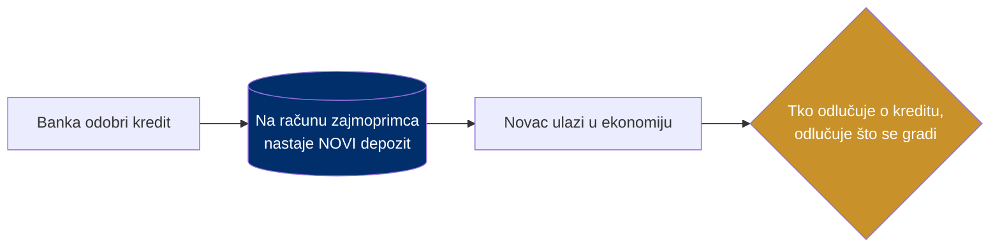
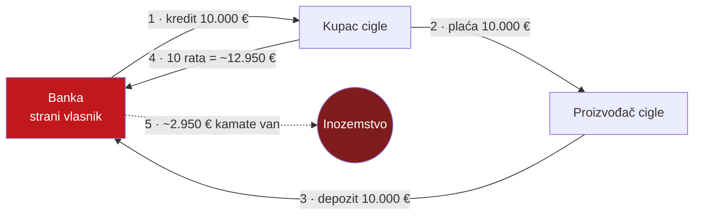

# Kako nastaje novac — i kako kamata odlazi van

> **Poanta u jednoj rečenici:** banke ne posuđuju tuđu štednju — kad odobre kredit, stvaraju novi novac; a kamata na taj novac trajno odlazi vlasniku banke.

---

## 1. Banke stvaraju novac

Kad banka odobri kredit, ona ne uzima novac iz nečije štednje. Ona **upisuje novi iznos na račun zajmoprimca** — i time stvara novi depozit. Krediti stvaraju depozite, ne obrnuto.

Procjenjuje se da je **oko 97% novca u optjecaju** nastalo upravo tako (Bank of England, *Money creation in the modern economy*, 2014.).

> Moć stvaranja novca = moć alokacije kredita. Pitanje je samo: tko je drži i u čiju korist.

---

## 2. Simulacija kredita: gdje odlazi kamata

Najjednostavniji prikaz problema. Tri sudionika, svi u istoj banci (u stranom vlasništvu):

- **Kupac cigle** (lokalni stanovnik)
- **Proizvođač cigle** (lokalni susjed)
- **Banka** (strani vlasnik)

| Korak | Što se događa |
|---|---|
| 1. Kredit | Banka stvara 10.000 € "iz ničega" i daje kupcu. Kupac duguje 10.000 € + 5% kamate na 10 godina. |
| 2. Kupovina | Kupac plaća proizvođaču 10.000 € za ciglu (lokalno, susjed → susjed). |
| 3. Depozit | Proizvođač vraća 10.000 € u banku. Novac je napravio puni krug — ali **dug ostaje**. |
| 4. Otplata | Kupac 10 godina otplaćuje. Ukupno vrati **~12.950 €** za posuđenih 10.000 €. |
| 5. Bilanca | **~2.950 € čiste kamate** trajno napušta lokalnu ekonomiju i odlazi stranom vlasniku banke. |

> Cigla je proizvedena lokalno, novac je kružio između susjeda — ali **kamata od ~2.950 € izvučena je iz zajednice.** Pomnožite to s tisućama kredita i vidite razmjer (vidi [01-problem-ekstrakcija](01-problem-ekstrakcija.md)). Što je kamata viša i rok dulji — veća je ekstrakcija.

*Brojke: glavnica 10.000 €, kamata 5%, rok 10 god., anuitet ~1.295 €/god. Izvor mehanike: dokument D (interaktivna simulacija).*

---

## 3. Zašto stablecoin tu nešto mijenja

airKUNA ne ukida kredit ni kamatu. Ali rezerva iza stablecoina **može stajati u etičkoj/domaćoj banci** koja je usmjerava u lokalni kredit — pa kamatni prinos i platne marže ostaju u domaćoj ekonomiji umjesto da odu van. Vidi [09-poslovni-model](09-poslovni-model.md).
