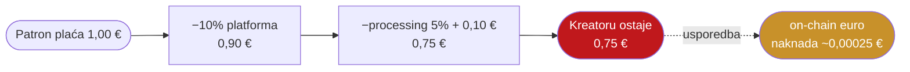

# Kome ovo pomaže: kreatori i mali poduzetnici

> **Poanta u jednoj rečenici:** kreator iz Hrvatske gubi 15–40% prihoda na naknade platformi i kartica — on-chain euro naplaćuje naknadu od djelića centa.

Ovo je konkretno lice problema: ne apstraktna ekonomija, nego osoba koja prima donacije, pretplate ili plaćanja preko interneta.

---

## Problem: gdje nestaje novac

Kad kreator naplati pretplatu ili donaciju, novac prolazi kroz više posrednika — svaki uzme svoj dio:

| Posrednik | Naknada |
|---|---|
| Platforma (npr. Patreon, novi kreatori od kol 2025.) | **10%** |
| Obrada plaćanja (kartica) | 2,9% + €0,30 (US) / **1,5% + €0,25 (EU)** |
| Konverzija valute | ~1–4% |
| Isplata na banku | ~€0,25–0,50 |

**Efektivna naknada: 15–30% (do ~40% za male ili prekogranične iznose).** Na mikro-plaćanjima ispod €3 može premašiti 50%.

### Primjer: €1 donacija

**Četvrtina svake €1 donacije nestane u naknadama.** Ako patron plaća iz druge valute, dodaj još ~2,5%.

---

## Brojke (provjereno)

| Tvrdnja | Broj | Izvor |
|---|---|---|
| Naknade kreatorima | 15–40% prihoda | dok. A / Spark (2026.) |
| Patreon platformska naknada (novi, od 4.8.2025.) | 10% | Patreon Help Center |
| Obrada plaćanja, EU | 1,5% + €0,25 | Stripe pricing (EEA) |
| Solana naknada po transakciji | ~0,00025 € | solana.com |
| Globalno tržište kreatora | ~250 mlrd $ (2023.) → ~480 mlrd $ (2027.) | Goldman Sachs |
| EU segment | ~28–33 mlrd € (2025.); do €135 mlrd 2032. | BNP Paribas |
| Hrvatska — digitalne vještine stvaranja sadržaja | 81,5% (EU prosjek 68,3%) | US Trade.gov |
| Hrvatski PDV | 25% (jedan od najviših u EU) | VATAi |

---

## Zašto je Hrvatska posebno pogođena

- Visok **PDV od 25%** + relativno malo domaće tržište → porezna usklađenost je teret za kreatore koji prodaju EU publici.
- Visok udio digitalnih vještina (81,5%) i internetske penetracije (>92%) → velik potencijal, ali infrastruktura plaćanja zaostaje.

---

## Rješenje: regulirani euro on-chain + Merchant of Record

Kombinacija je ono što danas nitko ne nudi za EU kreatore:

1. **On-chain euro (EMT)** — namira u sekundi, naknada djelić centa, bez kartičnih posrednika.
2. **Merchant of Record (MoR)** — regulirani subjekt preuzima PDV i usklađenost umjesto kreatora (kreator ne mora sam prijavljivati PDV po 27 zemalja).

> Rezultat: umjesto 15–30% naknada, kreator zadržava gotovo cijeli iznos, a porezna obveza je riješena automatski. Vidi [06-rjesenje-stablecoin](06-rjesenje-stablecoin.md).

*Napomena: on-chain naknada (gas) nije isto što i puni trošak fiat-ulaz → fiat-izlaz; custody i on/off-ramp dodaju nešto troška. Prednost je najveća na prekograničnim i malim iznosima.*
