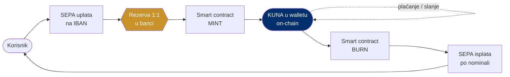

# Rješenje: regulirani euro stablecoin (airKUNA)

> **Poanta u jednoj rečenici:** airKUNA je digitalni euro pokriven 1:1 pravim eurom u rezervi, koji možeš poslati u sekundi i u svakom trenutku vratiti u euro na svoj račun.

---

## Što je airKUNA

"KUNA" je **brand** — digitalna hrvatska kuna. Vrijednost ispod tokena je **euro**. Pod europskom regulativom MiCA to je **e-money token (EMT)**: regulirani digitalni novac, a ne špekulativna kriptovaluta.

| Svojstvo | airKUNA |
|---|---|
| Pokriće | 1 KUNA = 1 EUR, full-reserve (za svaki token jedan euro u segregiranoj rezervi) |
| Otkup | po nominali (1:1), bilo kada — zakonsko pravo pod MiCA-om |
| Klasifikacija | MiCA e-money token (EMT) |
| Izdavatelj | regulirana institucija e-novca (EMI) ili kreditna institucija |
| Nadzor (HR) | HNB (izdavatelji EMT-a) + HANFA (pružatelji usluga / CASP) |
| Tehnologija | open-source, auditirani smart contracti |

> Bitno: Hrvatska je u eurozoni od 1.1.2023. (1 € = 7,53450 kn); kuna više ne postoji kao valuta. "KUNA" je **kulturni brand nad eurom**, ne zasebna ili oživljena valuta.

---

## Kako radi: od SEPA uplate do tokena i natrag

*Zlatno = fiat / SEPA tračnica · plavo = on-chain (mint, wallet, burn). Rezerva je uvijek puna 1:1; mint i burn vezani su isključivo uz stvaran tok eura.*

1. **Mint:** uplatiš euro SEPA-om na IBAN → smart contract kreira jednaku količinu KUNA u tvom walletu.
2. **Koristiš:** šalješ, plaćaš, primaš — u sekundi, 0–24, bez granica.
3. **Burn (otkup):** vratiš token → smart contract ga spali → euro stiže natrag na tvoj bankovni račun, po nominali.

---

## Što MiCA jamči (plain language)

MiCA (Uredba EU 2023/1114) je europski okvir za kripto-imovinu. Za stablecoin tipa airKUNA (EMT):

- **1:1 rezerva** u svakom trenutku.
- **Pravo na otkup po nominali**, na zahtjev, bez naknade iznad minimalnog iznosa.
- Izdavatelj **mora biti licenciran** (EMI ili banka).
- Pravila za stablecoine vrijede od **30.6.2024.**, puni MiCA od **30.12.2024.**

To je razlika prema "običnoj kripto": airKUNA je **regulirani digitalni novac s pravnim jamstvom otkupa**, ne nešto čija vrijednost pluta.

---

## Zašto je to bolje od današnjeg sustava

| | Današnji sustav (banke u stranom vlasništvu) | Euro stablecoin (airKUNA) |
|---|---|---|
| Gdje ostaje vrijednost | dobit ide stranoj matici | rezerva pod domaćom kontrolom |
| Transparentnost | neproziran | javni lanac, provjerljivo |
| Brzina | radno vrijeme, posrednici | sekunde, 0–24, bez granica |
| Prekogranično | sporo i skupo | naknada djelić centa |
| Programabilnost | ne | da (automatske pretplate, uvjeti) |

Vidi i: [07-dokazani-model-monerium](07-dokazani-model-monerium.md) (dokaz da model radi), [08-kuharica-kako-izdati](08-kuharica-kako-izdati.md) (kako se izdaje), [09-poslovni-model](09-poslovni-model.md) (kako zarađuje).
