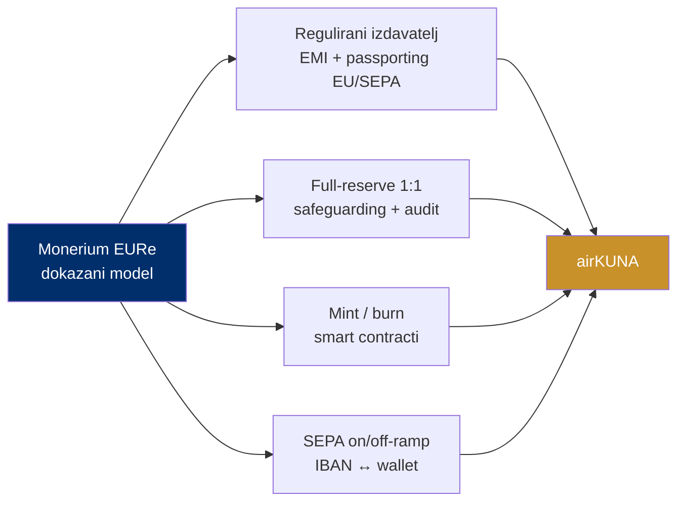

# Dokazani model: Monerium EURe

> **Poanta u jednoj rečenici:** ne izmišljamo model — Monerium isti taj regulirani euro na blockchainu radi godinama pod EU licencom.

Najveći rizik kod ovakvog projekta je "hoće li regulator i tehnologija uopće dopustiti ovo?". Odgovor je već poznat: **da, jer to već postoji.**

---

## Monerium EURe — referenca

| | Monerium EURe |
|---|---|
| Što je | euro stablecoin izdan kao **regulirani e-novac (EMT)** |
| Izdavatelj | Monerium EMI ehf, Reykjavík, Island |
| Osnovan | **2016.** |
| Licenca | licencirana institucija e-novca (EMI), pod EU pravilima o e-novcu i MiCA-om; **prvi EMI ovlašten za e-novac na blockchainu** |
| Passporting | kroz cijeli EEA |
| Pokriće | 100% pokriveno visokokvalitetnom eurskom rezervom u segregiranim računima |
| Otkup | pravo na otkup po nominali, bilo kada |
| Lanci | **6: Ethereum, Polygon, Gnosis, Arbitrum, Base, Linea** |
| IBAN/SEPA | individualni i poslovni EUR IBAN-i povezani s walletom; transferi banka ↔ wallet |

*Izvor: monerium.com/eure; Bleap; TheBanks.eu.*

---

## airKUNA primjenjuje isti recept

1. **Regulirani izdavatelj** — e-money licenca (EMI) i passporting kroz EU/SEPA.
2. **Full-reserve 1:1** — segregirana rezerva, safeguarding, neovisni audit.
3. **Mint / burn smart contracti** — kontrolirane role, on-chain transparentnost.
4. **SEPA on/off-ramp** — IBAN povezan s walletom; uplata minta, otkup vraća euro.

Razlika airKUNA: **prilagodba hrvatskom i regionalnom (CEE) kontekstu** i fokus da vrijednost ostane u domaćoj ekonomiji.

---

## Već radi danas (live stack)

airKUNA tim već koristi pravi Monerium IBAN (preko banke LHV Pank) i stvarne transakcije na Gnosis Chainu:

| Adresa | Što je |
|---|---|
| wallet.domovina.ai | Self-custody EURe novčanik — passkey (Face ID), bez seed fraze. SEPA → EURe i slanje. |
| pay.domovina.ai | Uplatni kodovi: SEPA EPC QR, HUB3 (FINA), on-chain EIP-681. |
| mpt.domovina.ai | Backend: Monerium API, mint/burn orkestracija (Safe + Zodiac Roles). |

> Nije prototip — cijeli stack je live. To dokazuje da je tehnologija i regulatorni put **provjeren i izvediv**, ne hipotetski.
