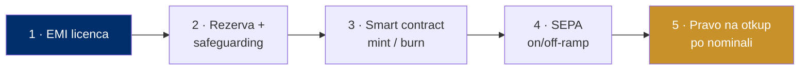

# Kuharica: kako izdati svoj euro stablecoin

> **Poanta u jednoj rečenici:** regulatorni okvir (MiCA) je jasan, tehnologija je open-source — pet koraka dijeli te od eura do tokena.

Ovo nije tajna ni magija. Recept je javan; airKUNA ga samo izvodi za hrvatski i regionalni kontekst.

---

## Pet koraka — dijagram

*Pet koraka reguliranog euro stablecoina (MiCA e-money token).*

---

## Koraci (plain language)

### 1 · E-money licenca (EMI)
Trebaš biti regulirana institucija e-novca (ili banka). Jednom odobrena licenca **passporta se kroz cijeli EU/SEPA** — ne treba ti licenca u svakoj zemlji. Nadzor u Hrvatskoj: HNB (za EMT), HANFA (za pružatelje usluga).

### 2 · Rezerva i safeguarding
Za svaki izdani token držiš **jedan euro u segregiranoj rezervi** u kreditnoj instituciji, u niskorizičnim instrumentima. Obavezni su **neovisni audit i javne potvrde (attestations)** da je rezerva puna.

### 3 · Smart contract: mint i burn
Open-source, auditirani ugovori koji kreiraju (mint) i spaljuju (burn) token. KYC/limiti/blacklist mogu biti ugrađeni u svaki transfer — usklađenost na razini protokola.

### 4 · SEPA on/off-ramp
IBAN povezan s walletom. Uplata eura → mint; otkup → euro natrag na račun. Idealno preko SEPA Instant (namira u sekundama).

### 5 · Pravo na otkup po nominali
Korisnik u svakom trenutku može vratiti token i dobiti euro **1:1**. To nije usluga dobre volje — to je **regulatorni zahtjev** pod MiCA-om.

---

## Što to praktično znači

Cijeli put je **provjeren** (vidi [07-dokazani-model-monerium](07-dokazani-model-monerium.md)) i **regulatorno jasan** (vidi [06-rjesenje-stablecoin](06-rjesenje-stablecoin.md)). Glavni posao nije tehnološki rizik nego **regulatorni iskorak** (dobivanje/partnerstvo za EMI) i distribucija.

*Izvori: MiCA (Uredba EU 2023/1114); EBA/ESMA; HANFA/HNB; Monerium.*
