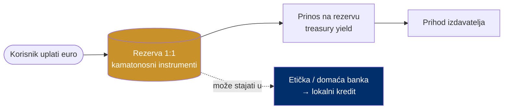

# Poslovni model: treasury yield

> **Poanta u jednoj rečenici:** rezerva koja stoji iza tokena drži se u kamatonosnim, niskorizičnim eurskim instrumentima — prinos na tu rezervu je glavni izvor prihoda.

---

## Kako stablecoin zarađuje

Korisnik uplati euro, dobije token. Taj euro **ne stoji mrtav** — drži se u sigurnim, kamatonosnim eurskim instrumentima (npr. kratkoročni državni instrumenti, depoziti). Kamata na rezervu je prihod izdavatelja.

- Kod Circlea (USDC) **~94% prihoda** dolazi upravo od prinosa na rezervu.
- Prihod **skalira linearno** s količinom tokena u optjecaju.

---

## Ilustrativni izračun

| Stavka | Vrijednost |
|---|---|
| Rezerva (primjer) | 25.000.000 € |
| Godišnji prinos | ~2,5% |
| Godišnje za podjelu | ≈ 625.000 € |
| Skaliranje | linearno s opticajem |

> Ilustrativno, nije ponuda. Prinosi u eurima niži su od dolarskih.

---

## Dodatna vrijednost: rezerva kao lokalni kapital

Ovdje airKUNA ide korak dalje od čistog stablecoina. Rezerva može biti **stabilna depozitna baza za etičku/domaću banku** koja je usmjerava u realnu, lokalnu ekonomiju — umjesto da kamatni prinos i platne marže odu stranoj matici (vidi [01-problem-ekstrakcija](01-problem-ekstrakcija.md)).

Tako se model zatvara: novac koji danas "curi van" ostaje raditi doma.

*Izvori: Circle (USDC) javni podaci o strukturi prihoda; ilustrativni izračun.*
