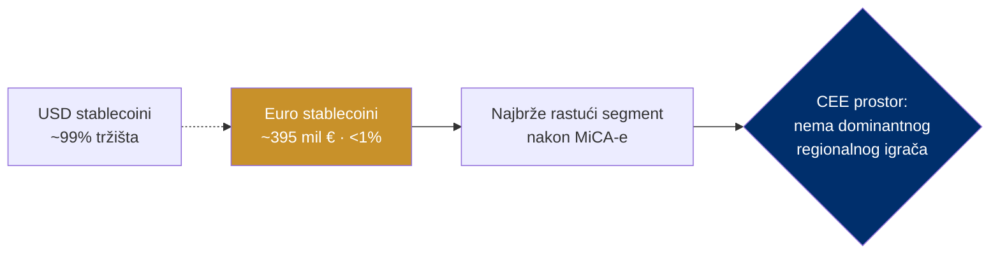

# Tržište i prilika

> **Poanta u jednoj rečenici:** euro stablecoini su najmanji segment tržišta koji raste najbrže — a nema dominantnog regionalnog (CEE) igrača.

---

## Veličina tržišta (provjereno — ECB)

| Podatak | Vrijednost | Izvor |
|---|---|---|
| Stablecoini namireni 2024. | **~27,6 bilijuna $** — više nego Visa + Mastercard zajedno | CryptoSlate / Visual Capitalist |
| Ukupni market cap stablecoina | **> 280 mlrd $** (stu 2025.), ~8% kripto tržišta | ECB FSR 11/2025 |
| Udio USD stablecoina | **~99%** | ECB FSR |
| Euro stablecoini ukupno | **~395 mil €** | ECB FSR |
| Vodeći EUR stablecoin (EURC) | ~41% euro segmenta | CoinGecko / ECB |
| Projekcija ukupnog tržišta | **2 bilijuna $ do 2028.** | ECB FSR |

> Pažnja na razliku: **27,6 bilijuna $ je godišnji volumen namire** (uključuje botove/DeFi/burze, koristiti oprezno), a **280 mlrd $ je ukupna kapitalizacija** (koliko vrijedi svih tokena u optjecaju). To su dvije različite mjere.

---

## Prilika — dijagram

---

## Zašto sada

1. **Regulatorni jaz je zatvoren.** MiCA daje jasan okvir (EMT) od 2024. — više nema pravne neizvjesnosti.
2. **Euro segment je sićušan ali eksplodira.** Manje od 1% tržišta, ali raste najbrže nakon MiCA-e; apsolutna baza je još mala (~395 mil €).
3. **Nitko nije zauzeo CEE.** Nema dominantnog regionalnog euro stablecoina. **Tko prvi poveže SEPA i mint, definira standard.**
4. **Tehnologija je dokazana i live** (vidi [07-dokazani-model-monerium](07-dokazani-model-monerium.md)).

---

## Dvostruki TAM (za investitore)

- **Zaustavljanje odljeva:** > 3 mlrd €/3 god. dividendi van Hrvatske + kartične/platne marže (vidi [01-problem-ekstrakcija](01-problem-ekstrakcija.md)).
- **Creator economy:** EU segment ~28–33 mlrd € (2025.), do €135 mlrd 2032. (vidi [05-creator-economy](05-creator-economy.md)).
