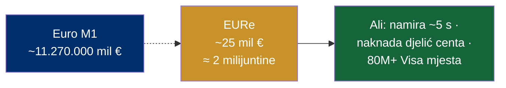

# Razmjer: koliko je EURe malen — a koliko moćan

> **Poanta u jednoj rečenici:** u Monerium EURe nalazi se tek ~25 milijuna eura — oko **2 milijuntine** ukupnog euro novca u opticaju — a taj isti euro se on-chain šalje za djelić centa, namiruje u ~5 sekundi i troši na 80+ milijuna Visa mjesta.

Ovo je ključna fintech poanta: **inovacija nije u veličini, nego u sposobnosti.** On-chain euro je danas ekonomski nevidljiv pored centraliziranog eura — ali tehnološki radi sve što centralizirani ne može (programabilno, 0–24, bez granica, transparentno).

---

## Koliko je EURe malen

| Usporedba | Iznos | EURe kao udio |
|---|---|---|
| **Monerium EURe (ukupno izdano)** | **~25 mil €** | — |
| Euro M1 (gotovina + tekući računi) | ~11,27 bilijuna € | **~0,00022%** (≈ 2 milijuntine) |
| Fizički euro (novčanice i kovanice) | ~1,5 bilijuna € | **~0,0017%** (≈ 16 milijuntina) |
| Euro M3 (široki novac) | ~17,43 bilijuna € | ~0,00014% |
| Cijelo tržište stablecoina | > 300 mlrd $ | ~0,009% |
| Euro stablecoin segment | ~395 mil € | **~6%** (znatan dio *euro* segmenta) |

> Za svaki **1 € u EURe**, postoji **~60.000 € papirnatog eura** u opticaju. EURe je zaokruživalna greška centraliziranog eura — a ipak radi.

*Maleno u količini, ne u sposobnosti.*

---

## Euro stablecoini — poredak (2025.)

| Token | Izdavatelj | Veličina / udio |
|---|---|---|
| EURC | Circle | ~41–42% euro segmenta |
| EURS | Stasis | ~284 mil $ (+644% g/g) |
| EURCV | Société Générale (SG-Forge) | u snažnom rastu |
| **EURe** | **Monerium** | ~25 mil € (manji po cap-u, ali regulatorni i tehnološki pionir) |

*Napomena: ECB navodi euro segment ~395 mil € (stu 2025.); Decta navodi širi obuhvat ~6,83 mlrd $ (pro 2025.) — razlika je u metodologiji. EURe je manji po kapitalizaciji, ali je prvi EMI koji je izdavao e-novac na blockchainu (vidi [07-dokazani-model-monerium](07-dokazani-model-monerium.md)).*

---

## Zašto je on-chain euro jeftin — posebno na Gnosis Chainu

EURe živi na 6 lanaca, ali je **Gnosis Chain de-facto matični lanac** (euro izbora za Circles UBI i Gnosis Pay).

| Svojstvo Gnosis Chaina | Vrijednost |
|---|---|
| Naknada po transakciji | **~0,001–0,01 $** (djelić centa) |
| Plin (gas) se plaća u | **xDAI** — stablecoinu → predvidiva, stabilna naknada |
| Vrijeme bloka | ~5 sekundi |
| Finalnost | ~2,6 minute |
| Kompatibilnost | EVM (Ethereum dApps lako prelaze) |
| Sigurnost | 145.000+ validatora |

> Za razliku od lanaca gdje plin plaćaš volatilnim native tokenom, na Gnosisu plaćaš **stablecoinom** — pa znaš točno koliko transakcija košta. To čini mikro-plaćanja u euru praktičnima.

---

## Gnosis Pay — on-chain euro u stvarnom životu

- **Self-custody Visa debitna kartica** vezana na Safe pametni račun na Gnosis Chainu — trošiš čim dodirneš, sredstva ostaju u tvom walletu.
- U partnerstvu s **Moneriumom**: troši **EURe** na **80+ milijuna Visa mjesta** širom svijeta.
- Bez naknada, do 5% GNO cashbacka, Apple Pay, dostupno u cijelom EEA.

> Dokaz da regulirani on-chain euro nije laboratorij: već se njime plaća kava na Visa terminalu.

---

## Što to znači za airKUNA

1. **Tržište je tek na početku.** Ako je sav on-chain euro danas ~395 mil € (a EURe samo ~25 mil €), prostor za rast je golem — i nitko nije zauzeo CEE (vidi [10-trziste-prilika](10-trziste-prilika.md)).
2. **Infrastruktura je jeftina i provjerena.** Gnosis Chain daje namiru u sekundama za djelić centa — idealno za hrvatska/regionalna mikro-plaćanja i kreatore (vidi [05-creator-economy](05-creator-economy.md)).
3. **Sposobnost > veličina.** airKUNA ne mora biti velik da bi bio koristan — mora biti **reguliran, otkupiv 1:1 i jeftin za korištenje.**

*Izvori: CoinGecko / CoinMarketCap (EURe ~25 mil €); ECB (euro M1/M3, fizički euro; euro stablecoini ~395 mil €); Decta/CoinDesk (poredak); Gnosis.io / Gnosisscan / LI.FI (Gnosis ekonomika); Gnosis Pay / Decrypt / Blockworks (kartica). Detalji u [11-izvori](11-izvori.md).*
