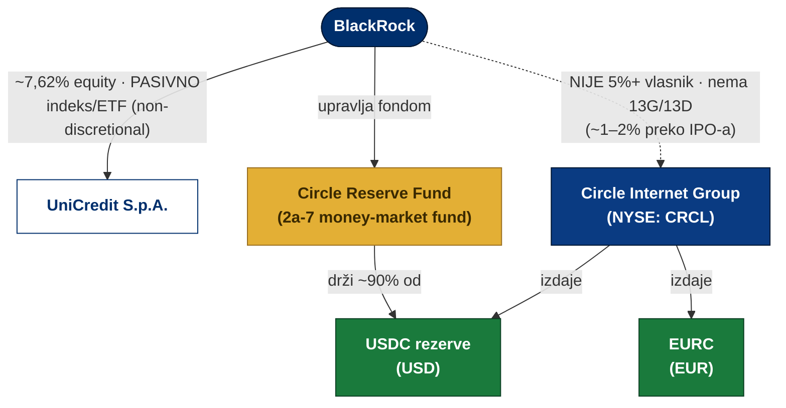

# 20 — Fact-check: BlackRock ↔ UniCredit ↔ Circle ↔ EURC/USDC

> Trajno znanje iz rada na `com/zamasnjak/` (treasury-flywheel). **Nije** dio landing koda —
> stranica **namjerno ne iznosi nijednu tvrdnju o BlackRocku**. Ovaj dokument bilježi *zašto*,
> s provjerenim brojkama, da se lažna tvrdnja nikad ne vrati u sadržaj.

## Kontekst

Prvotni (Gemini-generirani) prompt tvrdio je da je *„EURC backed by fiat in UniCredit Bank where
BlackRock has strategic ownership"*. Ta tvrdnja spaja tri nepovezane stvari i **činjenično je
netočna**. Provjereno preko regulatornih izvora (UniCredit shareholder page, Circle SEC 424B4 / EDGAR,
srpanj 2026.).

## Što je stvarno točno

| Tvrdnja | Verdikt | Detalj + izvor |
|---|---|---|
| BlackRock ~7% vlasnik **UniCredita** | ✅ **točno, ali pasivno** | **7,62%** (UniCredit „Shareholders structure", ožujak 2026.), ali footnote *„non-discretional asset management"* → indeksni fondovi/ETF-ovi za klijente, **ne strateški udio**. |
| BlackRock ~7% **equity vlasnik Circle-a** | ❌ **netočno** | BlackRock **nije** 5%+ vlasnik: nema SEC 13G/13D, ne pojavljuje se u ownership tablici IPO prospekta (424B4). Prijavljena IPO kupnja ~10% *ponuđenih* dionica ≈ **~1–2% tvrtke**. |
| BlackRock „stoji iza" **EURC-a** | ❌ **netočno** | BlackRock upravlja **Circle Reserve Fund**-om koji drži **~90% USDC (dolarskih)** rezervi — ne EURC. |
| UniCredit drži EURC rezerve | ❌ **netočno** | UniCredit nema veze s EURC rezervama; član je *konkurentskog* bankovnog stablecoin konzorcija (Qivalis). |

## Prava mreža odnosa

**Čitanje dijagrama:** puna strelica = stvaran, materijalan odnos; crtkana = *ne postoji* kao vlasništvo.
BlackRock **pasivno** drži ~7,6% UniCredita, **ne** drži Circle equity, ali **upravlja** fondom koji drži
~90% USDC rezervi. Circle je „pod istom kapom" u smislu da **izdaje i USDC i EURC** — pa je Circle↔BlackRock
veza stvarna (preko USDC rezervi), ali to **nije** vlasništvo Circle-a niti veza s EURC rezervama.

## Zaključak za sadržaj

- Landing (`com/zamasnjak/` i EN `com/flywheel/`) **ne spominje BlackRock** — i tako treba ostati.
- Ako se ikad doda, jedino činjenično: *„BlackRock je najveći (pasivni) dioničar UniCredita i upravlja
  fondom koji drži ~90% USDC rezervi — ali nema usporediv equity udio u Circleu."* Ništa jače od toga.
- Isti princip vrijedi općenito: **nema name-droppinga velikih institucija bez izvora** — to je bila
  glavna zamka koja je Gemini-verziju činila misleading za pravu firmu (ITalk d.o.o.).

## Povezano
- `com/zamasnjak/` (HR), `com/flywheel/` (EN, skriveno) — treasury-flywheel explainer
- `docs/handoffs/04-jezik-hrvatski-primarni.md` — jezična politika
