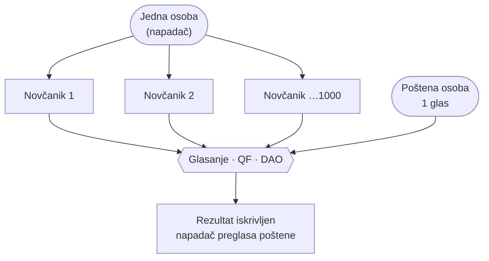
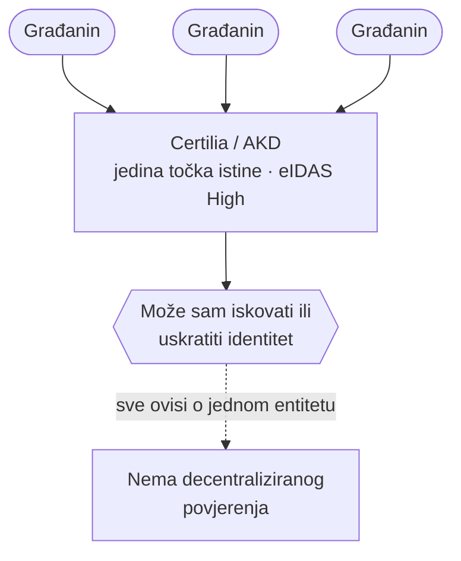
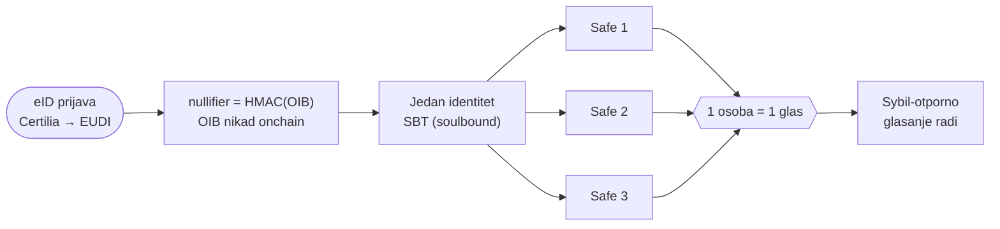

# Handoff #03 — Vizualizacija problema (MermaidJS) na airkuna.com

> **Kako koristiti:** nakon `/clear`, `cat` ovaj fajl. Memorija (`MEMORY.md`) se auto-učita.
> Cilj: manje teksta, više vizualnog — ljudi lakše razumiju sliku nego blok teksta.

## Kontekst (gdje smo)

`airkuna-web` = dvije samostojeće (single-file HTML) landing stranice, **obje LIVE u produkciji** (Cloudflare Pages):
- **`com/index.html`** → **airkuna.com** = Proof of Croatian Personhood (funding landing, ITalk d.o.o.).
- **`org/index.html`** → **airkuna.org** = stablecoin (airKUNA DAO).
- Pod-stranice: `com/whitepaper/` (docs/16 HR), `com/funding/` (docs/17 EN).

**Dizajn-sustav (koristi ga 1:1):** navy `#002F6C` / gold `#C8912A`/`#E3AF35` / red `#C0181C` / green `#1A7A3C`; fontovi Fraunces + Inter; komponente `.wrap/.narrow/.eyebrow/.title/.lead/.card/.figure/.mermaid/.reveal/.notewrap`. Mermaid je već uključen (CDN, `mermaid.initialize({theme:'base', …})` na dnu fajla) i renderira se iz `<div class="mermaid">…</div>` unutar `<div class="figure reveal">`.

**Deploy:** vidi memoriju `reference-airkuna-web-deploy.md` — wrangler iz direktorija **BEZ** `.env` (repo `.env` ima istekao token), apsolutna putanja, projekt `airkuna-com`. **NE deployaj bez izričite potvrde korisnika.**

## Zadatak

Na **airkuna.com** (`com/index.html`) zamijeni tekstualno-teške dijelove **Mermaid vizualizacijama** za dva današnja problema + viziju. Semantika boja mora biti očita na prvi pogled:

- **crveno = problem / napad / error** (`#C0181C`)
- **žuto/amber = upozorenje / caveat** (`#E3AF35` / `#C8912A`)
- **zeleno = rješeno / success** (`#1A7A3C`)
- neutralno: navy `#002F6C` = entitet/sustav, bijelo = osoba/građanin

### Referenca stila (OBAVEZNO proučiti)
- **https://pinka.io/kako-radi** — kako izgleda dobar, minimalan vizualni explainer.
- Lokalni izvor: `/Users/ms/git/pinka-finance/app/app/kako-radi/diagrams.ts` (+ `page.tsx`).
  Ključno iz njihovog stila: **kratki nodeovi** (podebljani naslov + JEDNA kratka linija preko `<br/>`), **smislene oznake na strelicama** (`-->|"..."|`), čist TB/LR flow, bez zida teksta. Mi tome DODAJEMO semantičko bojanje (crveno/žuto/zeleno) jer korisnik to izričito želi.

### Tri dijagrama za izraditi

Trenutne dvije `.card` u `#problem` sekciji (Sybil, Centraliziran eID) → pretvori u `.figure` s Mermaidom + kratki caption. Viziju (riješeno stanje) stavi u `#rjesenje` (ili kao „prije→poslije").

**Zajednički classDef (stavi u svaki dijagram):**
```
  classDef person fill:#fff,stroke:#002F6C,color:#002F6C,font-weight:600;
  classDef entity fill:#002F6C,stroke:#001631,color:#fff,font-weight:600;
  classDef bad fill:#C0181C,stroke:#7a1418,color:#fff,font-weight:600;
  classDef warn fill:#E3AF35,stroke:#9a6f1f,color:#3a2900,font-weight:600;
  classDef good fill:#1A7A3C,stroke:#0c3f23,color:#fff,font-weight:600;
```

**1) Sybil napad (problem — crveno).** Seed:

Caption: *„Bez dokaza osobnosti 1 čovjek = 1000 glasova → onchain glasanje postaje nepouzdano."*

**2) Centraliziran eID (problem/upozorenje — žuto→crveno).** Seed:

Caption: *„Vrhunski eID — ali centraliziran: jedan entitet = jedna točka kvara."*

**3) Vizija (riješeno — zeleno).** Seed:

Caption: *„eID → jedan nepovratni identitet → koliko god novčanika, samo jedan glas."*

**Bonus (razmisli):** „prije → poslije" side-by-side (crveni problem-blok lijevo → zeleni riješeni-blok desno) da pivot bude vizualno udaran. Odgovara traženom „crveno/error → zeleno/success".

## Pravila
- Single-file, self-contained, bez novih ovisnosti (mermaid je već tu). Responsive — `.figure` ima `overflow-x:auto`, na mobitelu dijagram scrolla unutar kartice.
- **Manje teksta:** čim dijagram prenosi poruku, skrati/izbaci originalni tekst kartice; ostavi samo kratki caption.
- **Točnost > hype:** MVP = verifier A/B; mesh = Faza 2; ne obećavaj regulatorni status. OIB nikad onchain.
- Zadrži postojeći ton i identitet stranice; airkuna.org NE diraj osim ako korisnik traži.

## Verifikacija + deploy
1. Lokalno: `python3 -m http.server 8755` → `http://localhost:8755/com/`. Screenshot desktop **i** mobitel (390px preko Chrome DevTools `resize_page`, jer claude-in-chrome ne ide ispod ~500px). Provjeri console (bez grešaka) i da se mermaid renderira + boje su ispravne.
2. Pokaži korisniku screenshotove.
3. **Deploy TEK uz izričitu potvrdu** → `airkuna-com` projekt (komanda u `reference-airkuna-web-deploy.md`). Commitaj semantički, pushaj na `main`.
